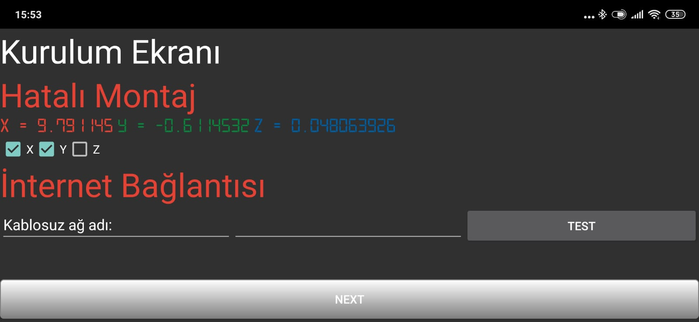
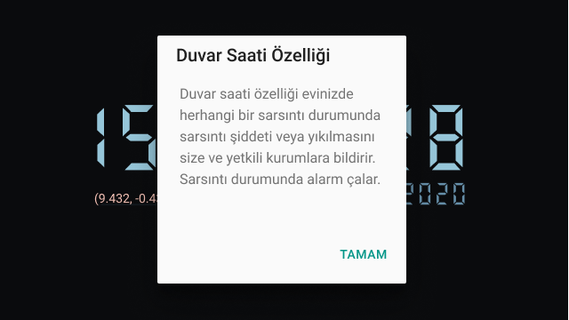
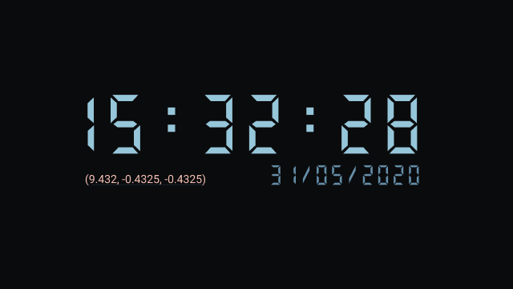
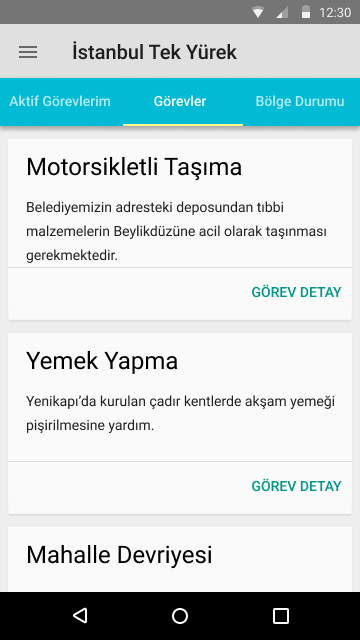
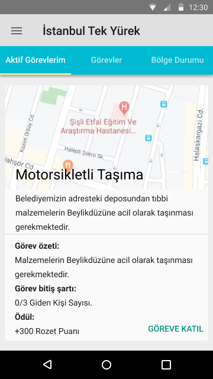
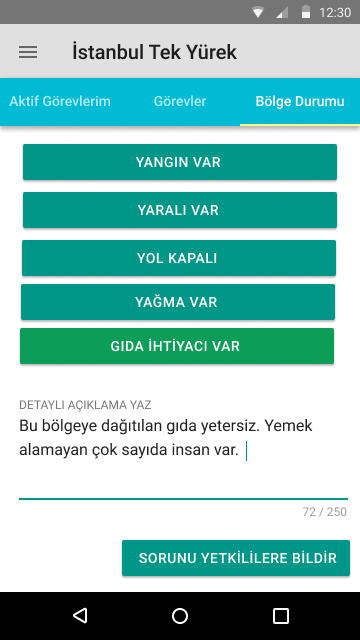
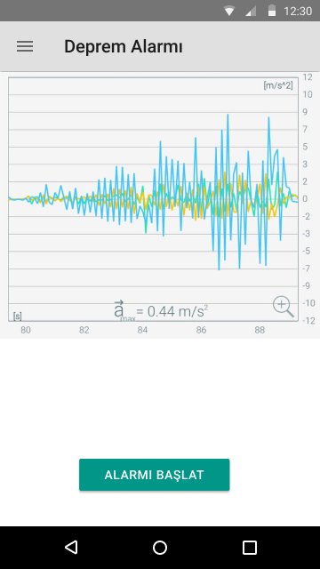
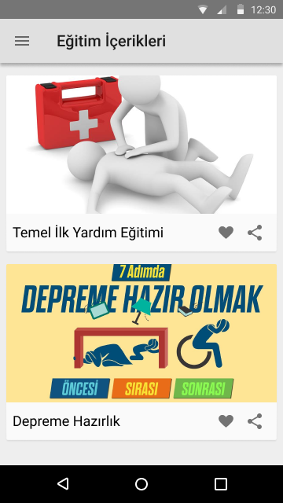
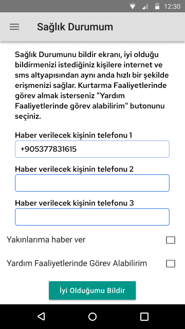
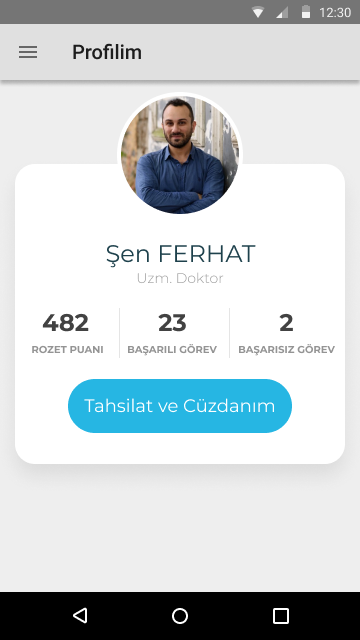

# Istanbul Tek Yürek, Web ve Mobil (Super-App) Projesi. 

[İngilizce için tıklayın](readme.md)

[Web Panel ve Deprem Simülatörü Kaynak Kodu](https://github.com/shenferhat/IstanbulTekYurekWeb)

[3 Dakikalık Uygulama Tanıtım Videosu](https://youtu.be/IHXcwA5wMpA)

## Deprem öncesi erken uyarı, deprem öncesi ve sonrası için organizasyon ve haberleşme projesi.
## Kullanılan teknolojiler: IoT, Blockchain, Gamification, Big Data.

### Deprem öncesi ve sonrasındaki bazı problemler
- Evin sağlamlığının bilinmemesi.
- Deprem ile ilgili verilerin az olması.
- Deprem öncesi için farkındalık ve hazırlığın deprem süresi uzadıkça git gide azalması.
- 20 Milyona yakın kişi arasında sivil savunma ve organizasyonel yetersizlikler.
- Erken uyarı sistemi olsa dahi bu uyarının alınacağı bir cihazın bulunmaması.
- Kapanan yollar, yıkılan köprüler sonrasında oluşturulacak alternatif güzergahlar.

## İnternet yoksa proje nasıl çalışacak?.
### Resmi bir kurumun internet noktalarını "uydu" üzerinden internet sağlaması gerekmektedir, mesajlar internetsiz depolanıp bu noktalardan internet bulunduğunda haberleşme sağlanabilir, bu internetin bütün dış ağa açık olması gerekmemektedir, uygulamanın sunucusu sağlanan bağlantı ile aynı ağa yerleştirildiği sürece haberleşme ve veri akışı devam edebilir.

# Bu Proje Ne İşe Yarar?
## Duvar saati modu: 

### 1- Eski android cihazınızı duvara monte ederek deprem erken uyarı sistemlerine bağlandığı takdirde bütün cihazlarda alarm üretir, herhangi bir erken uyarı sistemine bağlı olmama durumunda ise belli bir lokasyonda bulunan cihazların bir çoğunun titremesi durumunda deprem oluyor kararı oluşturularak bütün cihazlarda alarm üretir. Kişinin deprem olduğuna veya olacağına psikolojik olarak hazırlayıp güvenli bir şekilde pozisyon almasına imkan sağlar.
### Örnek senaryo 1
Cihazın kurulduğu lokasyon ile Deprem Risk haritası kurulum sırasında karşılaştırılır, cihaz 1. derece deprem bölgesinde ise ve belli bir sayıda cihazın aynı anda titremesi durumunda belli bir kilometre çapındaki bütün cihazlarda alarm üretilir. 
### Örnek senaryo 2
Deprem erken uyarı sistemi kurmuş olan kurumdan MQTT veya push notification üzerinden belirli bir kod ile uyarı sinyali beklenir. bu sinyal gönderildiği takdirde bütün cihazlar alarm durumuna geçer. Cihazların takılı olduğu haneler ile "Tatbikat" yapılabilir.

### 2- Evin mevcut ivme değeri ile ufak çaplı depremler sonrası oluşan ivme farkını merkezi sunucuya, üniversitelere, kullanıcıya vb. yerlere raporlar. Böylece evde bir kayma olup olmadığı tespit edilir.
  
### Örnek senaryo
Evinizin ivme değerleri X tarihindeki depremden sonra
X: 9.7112141, Y: 0.066076845, Z: 1.673657'den
X: 9.7112180, Y: 0.066076845, Z: 1.673657 değerlerine değişim göstermiştir.
Eski X ile yeni X arasındaki fark 0.0000039, bu farkın normal olup olmadığına bakılır.
### Örnek senaryo
Jiroskop'tan gelen X, Y, Z, verilerine göre binanın yıkılıp yıkılmadığı ile ilgili bilgi merkeze iletilir, evinden uzakta olan kişi evinin durumu ile ilgili bilgilendirilir.

### 3- Merkezde yıkılan binaların lokasyonları ile beraber bir harita oluşur, buna göre hangi semtte kaç örnek binadan kaçı yıkılmış olduğu tespit edilir, acil yardıma ihtiyacı olanların yoğunlukta olduğu semtler depremden sırasında ve sonraki ilk dakikalarda belirlenir.

# Görev ve Organizasyon Eksikliği
## Sorun 1: Afet durumunda şehirdeki herkesin afetzede sayılması
## Sorun 2: 20 milyon kişiden hayatta kalan kişilerin birbirine yardım etmesindeki oluşacak organizasyon problemleri
Kişi öncelikle adını, soyadını, kan grubunu ve yapabileceği işleri tanımlar, uygulamada görev lokasyonu, görev, görev özeti ve ödül bulunmaktadır, merkez size yapabileceğinizi ibraz ettiğiniz görevlere dayalı iş ataması yapar, bu görevler lokasyon bazlı olabilir, kişi kendisine atanan görevi kabul veya reddeder. Kabul eder ve görevi gerçekleştirir ise puan kazanır, görev maddi harcama gerektiriyor ise blokzincir yapısı üzerinden kendisine ve ekibine bir kredi tanımlanır ve bu ödemeyi bu kredi üzerinden gerçekleştirir. Uygulamanın görev bölümü deprem tatbikatlarının da yapılmasına imkan sağlar. Belli bir saatte uygulamanın yüklü olduğu telefonlara görevler atanır, aşçılık, yiyecek malzemelerini getirme, nöbet, koruma, çadır ve battaniye alarak görev tatbikat alanına getirme görevleri verilir, gece belli bir alanda konaklama sağlanır. Düzenlenen tatbikatlar ile kemikleşen bir kadro belirlenebilir, deprem sırasında bu kadro aynı görevleri icra edebilir.

# Göçük altında kalan kişi ile haberleşme
## Sorun 1: Üst üste devrilecek duvar vb. bir çok malzemenin ses dışındaki sinyallerin giriş çıkışını imkansıza yakın kılması.
Cihazın mors alfabesi ile yüksek tiz bir ses ile S.O.S sinyali yayınlaması, yazılan veya sesle okunan yazıyı morsa çevirip yayınlaması, enkazın üstündeki ekibin ise bir telefon ile veya kendileri dinleyerek bu mesajı almaya çalışması ile enkaz altındaki kişi ile haberleşme mümkün olabilir. 

# Bölge durumu ile ilgili bilgi ağı
## Sorun: Ulaşıma kapanan yollar, yangınlar, yağma gibi durumların yetkililere iletilmesi.
Kullanıcı lokasyonu işaretleyerek o bölgede yağma riski, yangın ve kapanan yolları merkeze ve yetkililere bildirir.

# Çevrimdışı Harita
# Sorun: Kişinin internetin olmadığı durumlarda adresi bulamaması.
İnternet'e erişilemeyen durumda bulunulan bölgenin çevrimdışı haritası indirilerek adres bulmada kullanılabilir. GPS internetsiz çalışan bir teknoloji olduğu için adres bulmada zorluk yaşanmaz.

# Deprem Alarmı
## Sorun: İnsanların uyuduğu saatte gerçekleşen depremde uyanma ve farkındalık sorunu.
Cihaz sabit bir yere konulup alarm kurulur, deprem alarmı ile jiroskoptan gelen x,y,z verileri ile S ve P sinyallerinin gelişi ile deprem algılanması ve uyandırma alarmı çalmaya başlar. Uygulamanın bu bölümünde yapay zeka kullanılarak hangi titreşimlerin deprem olabileceği gittikçe daha iyi şekilde algılanabilir.

# Deprem Çantam
## Sorun: Deprem çantasının hatırlanması.
Deprem çantası için bir alınacaklar listesi belirlenir, bu listeden malzemeler satın alındıkça işaretlenir, alınmayan malzemeler haftada bir kullanıcıya "notification" olarak hatırlatılır.

# Eğitim İçerikleri
## Sorun: Deprem öncesinde sırasında ve sonrasında yapılması gerekenler eğitimi olan kişilerin azlığı.
Depreme hazırlık vb. gerekli görülen eğitim içeriğinin uygulamanın içerisinden ulaşılabilir olması.

# Sağlık Durumum
İnternet altyapısının diğer altyapılardan daha sonra çökme ihtimali bulunduğu için sağlık durumunuzu bildirmek istediğiniz yakınlarınızda uygulama kurulu ise "İyi olduğumu bildir" butonuna basıldıktan sonra internet üzerinden sağlık durumunuzu bildirmeye çalışır, bildiri ulaşır ise size haber verir, bildirim gerçekleşemez veya bir gecikme yaşanır ise sms gönderir. 

# Profilim
Yapılan görevlerden alınan puanlar, başarılı ve başarısız görevlerin gösterildiği ekrandır. Deprem sonrasında depremde görev alan kişiler bir çok şekilde ödüllendirilebilir.

# Cüzdanım
Ödeme altyapılarının kullanılamaması durumunda blokzinciri yapısı dijital bir veresiye defteri gibi davranarak gönderim ve alım işlemi gerçekleştirebilir. 

# Kullanılan Teknolojiler
## Büyük veri (Big Data)
Cihazların takılı olduğu yerin titreşim verileri, alarm öncesi ve sonrasında toplanan jiroskop verileri, lokasyon verileri, meslek, yaş grubu gibi veriler toplanıp işlenebilir, cihazlar sağlam kalması durumunda uçaklardaki karakutu işlevi görebilir.

## Nesnelerin İnterneti (IoT)
Cihaz duvar ve alarm modlarında MQTT protokolü üzerinden haberleşmektedir. Titreşimlerin şiddetine göre merkezi sunucu üzerinde ısı haritası oluşturmaktadır.

## Blokzincir (Blockchain)
Finansal altyapıların çökmesi durumunda dijital bir veresiye defteri olarak kullanılmaktadır. Ancak ekip üyeleri bir araya gelince kullanıma açılacak olan kredi ve KYC ile kötü niyetli harcamaların önüne geçilir.

## Oyunlaştırma (Gamification)
Deprem öncesinde tatbikatlar, etkinlik ve organizasyonlar düzenlenir, bu organizasyonlara katılan kullanıcılar belli bir görevi gerçekleştirmek üzere bir araya gelirler, görevin gerçekleşmesi durumunda puan toplanır. Merkezi yapı kapalı blokzinciri yapısını kullanarak kullanıcıya harcamak üzere ödül de dağıtabilir.

# Meshnet neden yok?
## Meshnet yapısı uzun yıllardır geliştiriliyor olmasına optimum bir çözümü olmayan bir haberleşme biçimidir, örnek: veri paketinin 3 hop sonrası (kişinin paketi alıp bir diğerine iletmesi durumu) iletilip iletilmediği, manipüle edilip edilmediği vb durumların kontrolü çok zordur. Bu bluetooth protokolü için kullanıcıların birbirine "açık alanda" tam olarak bluetooth menzilinin ucunda varsayarsak 16*3=48 metre sonrası paket kayıpları oluşur, ekstra enerji beslemesi + bluetooth 5 teknolojisi ile 100*3 = 300 metre sonrası paket kayıpları yaşanabilir.
 
Meshnet için 15 KM'ye yakın menzili ile en uygun olduğunu düşündüğümüz Lorawan teknolojisinin ise İstanbul gibi bir şehri haberleşebilir hale getirmenin masrafı sadece cihazlar için, yazılım hariç milyon dolarları bulmaktadır.

# Takım: Afelyon
Şen Ferhat, Tansel Kaya, Utku Genel, Taha Hamad