# Istanbul Tek Yurek, Web and Mobile (Super-App) Project.

[Click for Turkish](readme-turkce.md)

[Web Panel and Earthquake Simulator Source Code](https://github.com/shenferhat/IstanbulTekYurekWeb)

[Application Introductions Video](https://youtu.be/IHXcwA5wMpA)

## Early warning before earthquake, organization and communication project for before and after earthquake.
## Technologies used: IoT, Blockchain, Gamification, Big Data.

### Some problems before and after the earthquake
- The soundness of the house is unknown.
- Low data on earthquakes.
- Awareness and preparation for the pre-earthquake decreases gradually as the earthquake duration increases.
- Civil defense and organizational inadequacies among nearly 20 million people.
- There is no device to receive this warning even if there is an early warning system.
- Alternative routes to be created after the closed roads and collapsed bridges.

## How will the project work if there is no internet?
### An official institution must provide internet points via "satellite", messages can be stored without internet and communication can be established when internet is available from these points, this internet does not have to be open to the entire external network, communication and data flow can continue as long as the application server is placed on the same network with the provided connection. .

# What Does This Project Do?
## Wall clock mode:

### 1- By mounting your old android device on the wall, if the earthquake is connected to the early warning systems, it generates an alarm in all devices, and in case of not being connected to any early warning system, an earthquake occurs in the event that most of the devices in a certain location vibrate and generate an alarm in all devices. It allows the person to take a safe position psychologically by preparing an earthquake.
### Example scenario 1
The location where the device is installed is compared with the Earthquake Risk map during the installation. If the device is in the 1st degree earthquake zone and if a certain number of devices vibrate at the same time, an alarm is generated in all devices within a certain kilometer diameter.
### Example scenario 2
A warning code with a certain code is expected from MQTT or push notification from the institution that has set up an earthquake early warning system. If this signal is sent, all devices go into alarm state. "Drill" can be done with the households where the devices are installed.

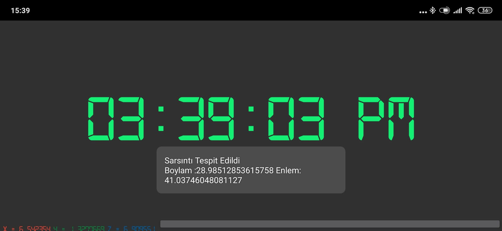

### 2- The current acceleration value of the house and the acceleration difference occurring after minor earthquakes can be shared by the central server, universities, user, etc. Reports to places. Thus, it is determined whether there is a sliding at home.
  
### Example scenario
Acceleration values of your home after the earthquake on X date
X: 9.7112141, Y: 0.066076845, Z: 1.673657
It changed to X: 9.7112180, Y: 0.066076845, Z: 1.673657.
The difference between the old X and the new X is 0.0000039, it is checked whether this difference is normal or not.
### Example scenario
According to the data of X, Y, Z from the gyroscope, information about whether the building has been demolished is transmitted to the center, and the person away from his home is informed about the condition of his house.

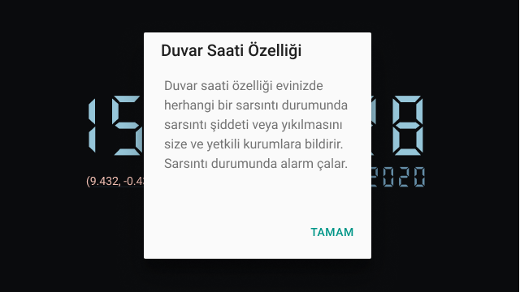
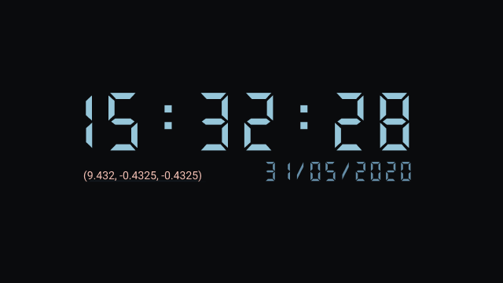

### 3- A map is created with the locations of the buildings demolished in the center, accordingly, how many sample buildings have been demolished in which neighborhood, the districts with the need for emergency assistance are determined during the earthquake and in the first minutes after the earthquake.

# Lack of Task and Organization
## Problem 1: In the event of a disaster, everyone in the city is counted as a disaster victim
## Problem 2: Organizational problems that will occur in helping people who survive from 20 million people help each other
The person firstly defines his name, surname, blood group and the jobs he can do, there is a task location, task, task summary and reward in the application, the center assigns a job based on the tasks you can do, these tasks can be location based, the person accepts or rejects the task assigned to him. If he accepts and performs the task, he earns points, if the task requires financial expenditure, a loan is defined for himself and his team through the blockchain structure and he makes this payment on this loan. The task part of the application also enables earthquake drills. At a certain hour, tasks are assigned to the phones with the application installed, tasks such as cooking, bringing food supplies, seizures, protection, tents and blankets and bringing them to the task application area, nighttime accommodation is provided in a certain area. A staff that ossifies with the organized exercises can be determined, and this staff can perform the same tasks during the earthquake.

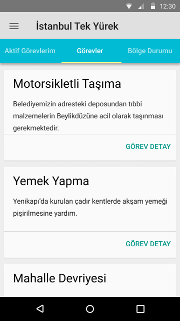
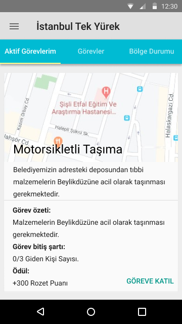
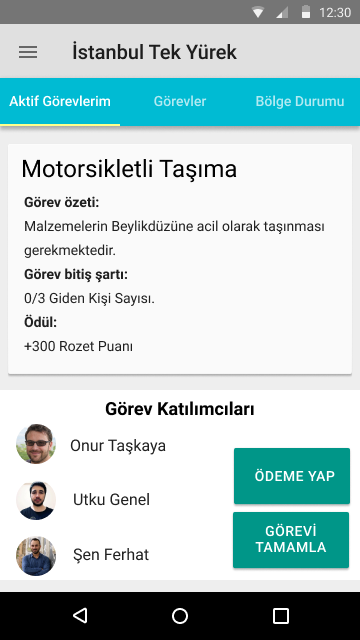

# Communication with the person under the dent
## Problem 1: The wall to fall over, etc. making the input and output of signals other than sound impossible in many materials.
It may be possible to communicate with the person under the wreck if the device transmits the S.O.S signal with a high-pitched voice in Morse alphabet, translates and transmits the text that is written or read by voice, and the team above the wreck tries to receive this message by listening to a phone or by listening to them.

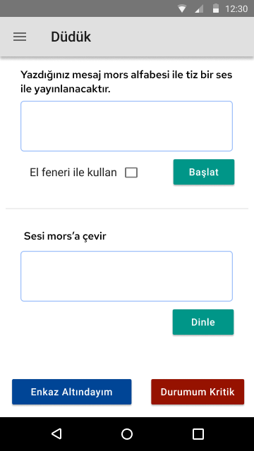

# Information network about region status
## Problem: Communicating situations such as roads closed to transportation, fires, looting etc. to the authorities.
By marking the location, the user notifies the center and the authorities about the risk of looting, fire and closed roads in that area.

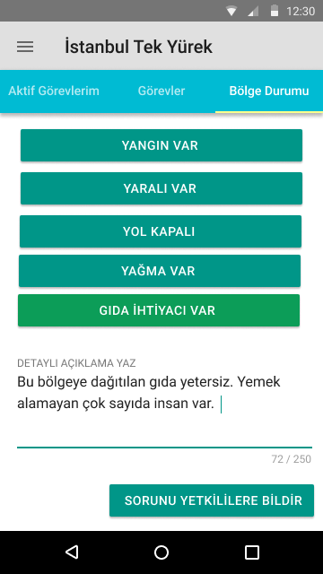

# Offline Map
# Problem: The person cannot find the address when there is no internet.
Offline map of the region where the internet is not available can be downloaded and used for address finding. Since GPS is a technology working without internet, there is no difficulty in finding addresses.

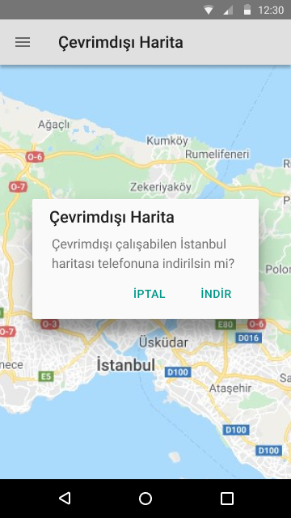

# Earthquake Alarm
## Problem: The problem of waking up and awareness in an earthquake that happens when people sleep.
The device is placed in a fixed place and the alarm is set, earthquake detection and wake-up alarm start ringing with the arrival of x, y, z data and S and P signals coming from the gyroscope. By using artificial intelligence in this part of the application, what vibrations may be earthquakes can be perceived better and better.

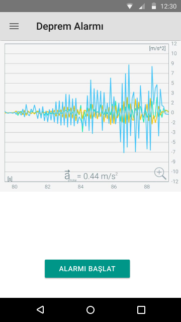

# My Earthquake Bag
## Problem: Remembering the earthquake bag.
A to-do list is determined for the earthquake bag, it is marked as the materials are purchased from this list, the non-received materials are reminded once a week as a "notification".

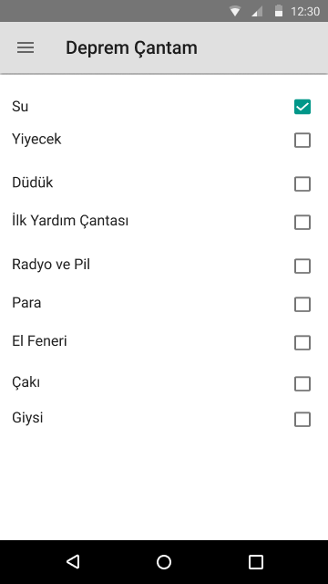

# Training Contents
## Problem: Lack of people with training to be done before and after the earthquake.
Earthquake preparation etc. education content deemed necessary to be available from within the application.

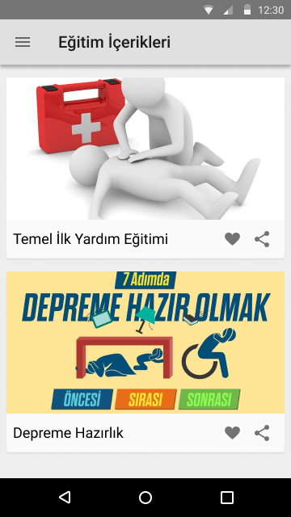

# My Health
Since the internet infrastructure is likely to collapse later than other infrastructures, if the application is installed near you, you want to report your health status, if the application is installed, it tries to report your health status over the internet after the "Report that I am good" button is pressed, if the notification is reached, it will notify you, it will not be sent or it will send sms if there is a delay.

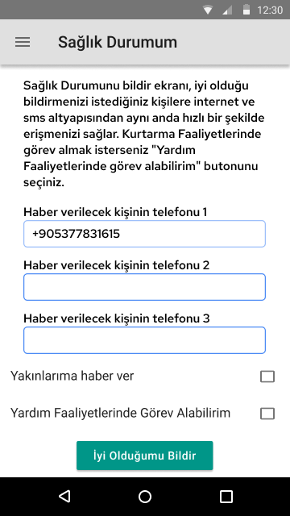

# My profile
The scores obtained from the tasks performed are the screen where successful and unsuccessful tasks are shown. People who took part in the earthquake after the earthquake can be rewarded in many ways.

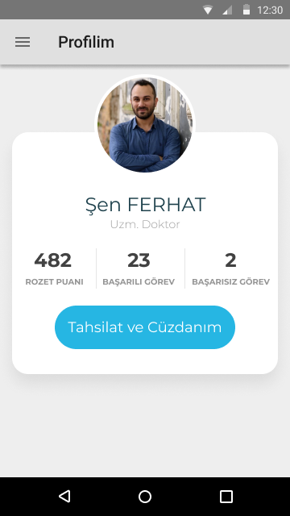

# My Wallet
In case the payment infrastructures are not available, the blockchain structure can act as a reliable money transfer system.

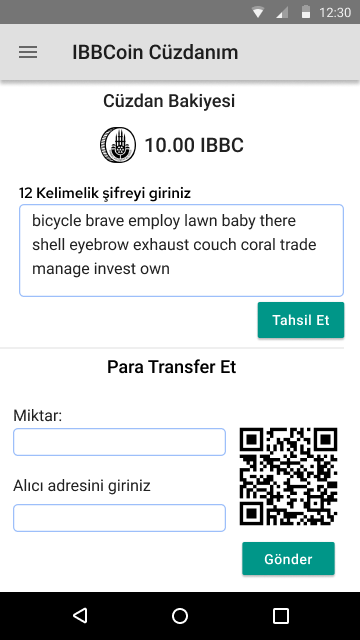

# Used technologies
## Big data
The data such as vibration data of the place where the devices are installed, gyroscope data collected before and after the alarm, location data, occupation, age group can be collected and processed, and if the devices remain intact, they can act as the character in the aircraft.

## IoT
The device communicates over the MQTT protocol in wall and alarm modes. It creates a heat map on the central server according to the intensity of the vibrations.

## Blockchain
In case of financial infrastructures collapse, it is used as a digital tax book. However, when the team members come together, credit and KYC, which will be put into use, are prevented from malicious expenses.

## Gamification
Exercises, events and organizations are organized before the earthquake, users participating in these organizations come together to perform a certain task, and points are collected in the event of the task. The central structure can also distribute rewards to the user to spend using the closed blockchain structure.

# Why is there no Meshnet?
## The Meshnet structure is a form of communication that does not have an optimum solution to its development for many years, for example: it is very difficult to control whether the data packet is transmitted after 3 hops (when the person receives the package and transmits it to another). For this bluetooth protocol, if we assume that each other is in the "open area" exactly at the end of the bluetooth range, packet losses occur after 16 * 3 = 48 meters, with extra energy supply + bluetooth 5 technology, packet losses after 100 * 3 = 300 meters.
 
The Lorawan technology, which we think is the most suitable with the range close to 15 KM for the pledge, makes the cost of making a city such as Istanbul able to communicate only million dollars for devices, excluding software.

# Team Afelyon
Şen Ferhat, Tansel Kaya, Utku Genel
